  

<!-- project overview -->

> Craftivo is a web application targeted freelancers to help them manage their projects, track time, collaborate with clients effectively and generate contracts
> the mission to add tasks for the projects and team members to each project, track invoice and time of the team they worked on and generate contract by AI.

  

<!-- System Design -->
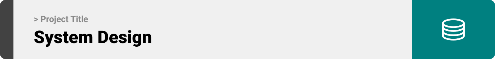

### System Architecture

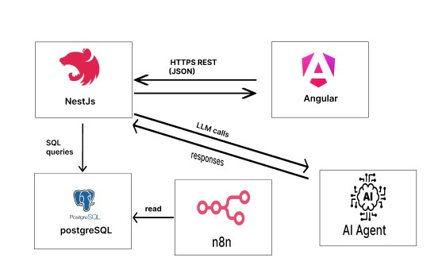

### ER Diagram

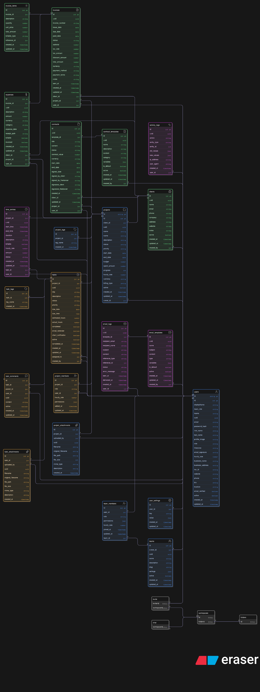

  

<!-- Project Highlights -->

### AlignPath main features

- Intelligent Document Creation:
  The system automatically fetches user emails, identifies those containing invoices, scrapes the invoice data, and securely stores it in the database.

- Smart Invoice Scraping:
  The system automatically fetches user emails, identifies those containing invoices, scrapes the invoice data, and securely stores it in the database.

- CSV Report Generation:
  Easily export member work hours into a structured CSV file, making tracking and reporting seamless.

  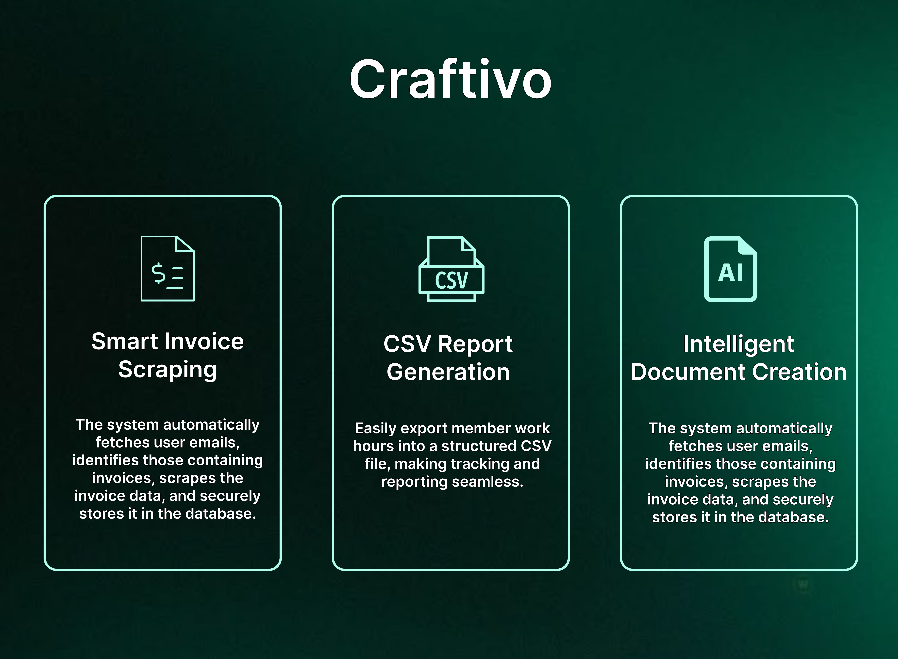
    

<!-- Demo -->

### Users Screens

| Landing Page                                  | Login Page                             |
| --------------------------------------------- | -------------------------------------- |
| 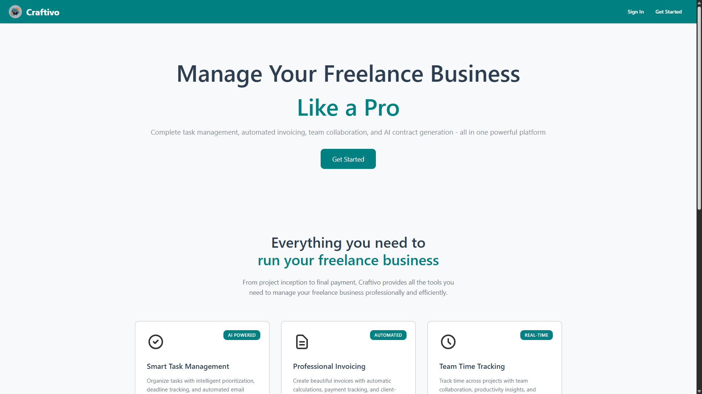 | 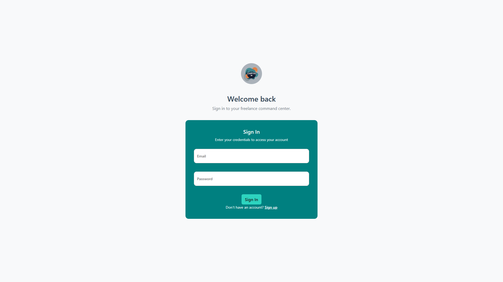 |

| Registration                              | Projects                                |
| ----------------------------------------- | --------------------------------------- |
| 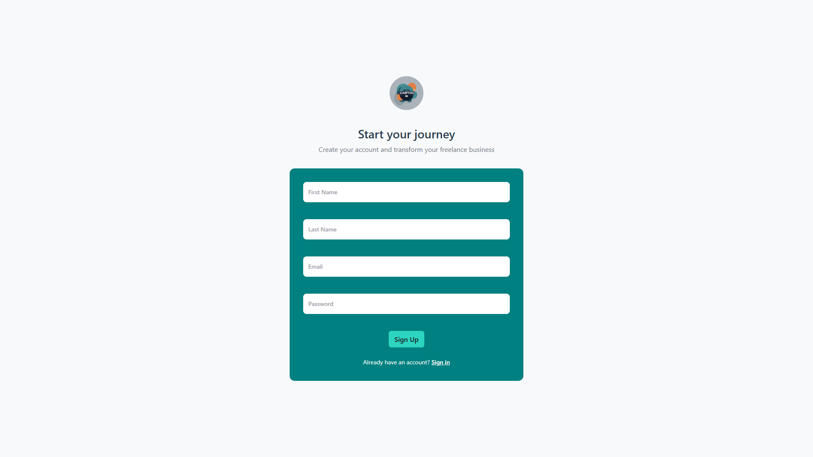 | 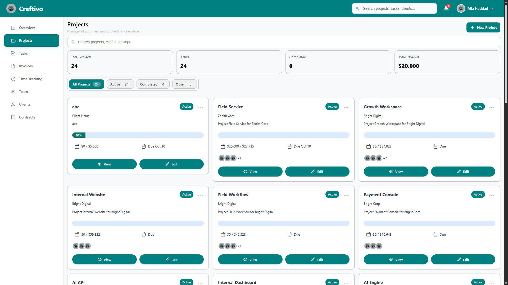 |

| Teams                                | Time Tracking                                   |
| ------------------------------------ | ----------------------------------------------- |
| 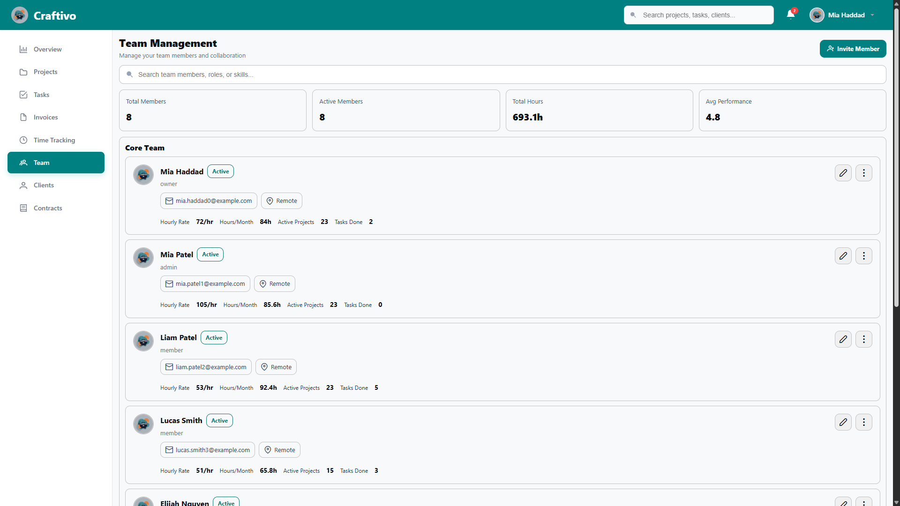 | 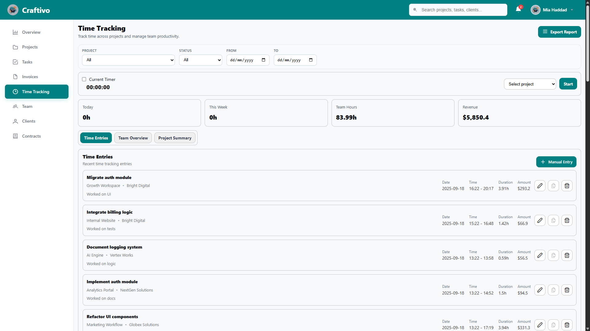 |

| invoices                                | contracts                                 |
| --------------------------------------- | ----------------------------------------- |
| 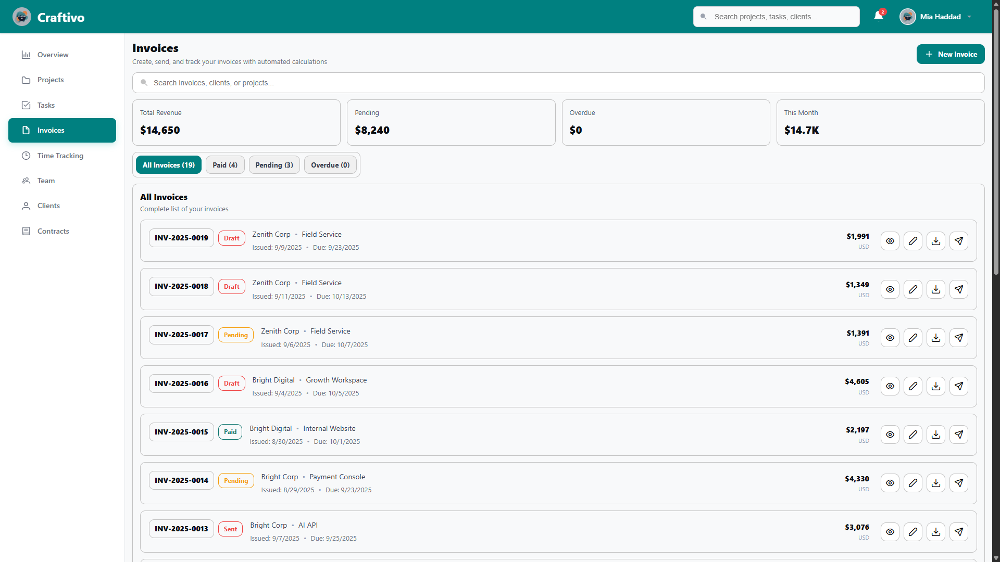 | 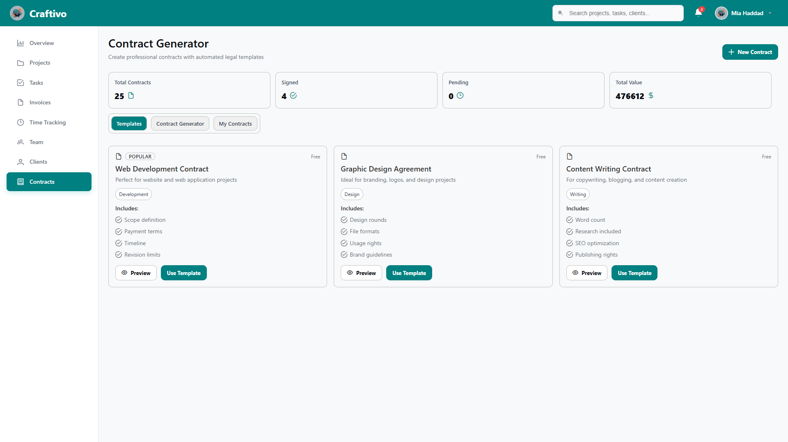 |

### AI Automation

| N8N Workflow                          |
| ------------------------------------- |
| 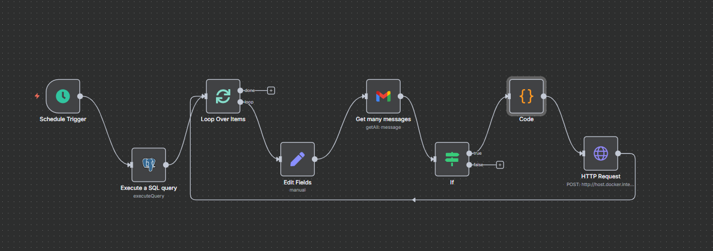 |

  

<!-- Development & Testing -->

### Functionality & Reliability

| Services                                                                                                  | Validation                                                                                                            | Testing                                                                                       |
| --------------------------------------------------------------------------------------------------------- | --------------------------------------------------------------------------------------------------------------------- | --------------------------------------------------------------------------------------------- |
|   |   |   |

| CI Workflow                         |
| ----------------------------------- |
| 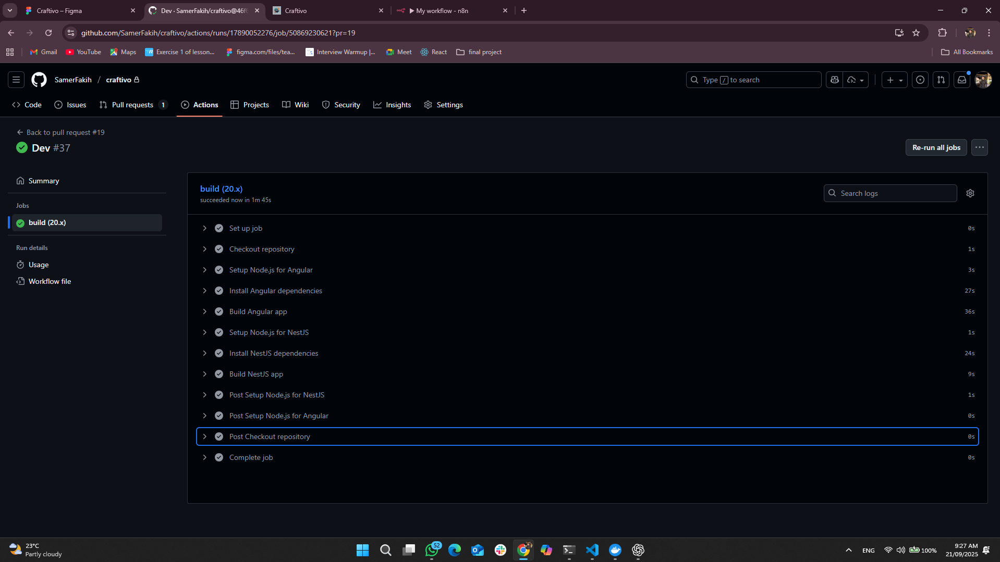 |

  

<!-- Deployment -->

### Deployment Architecture

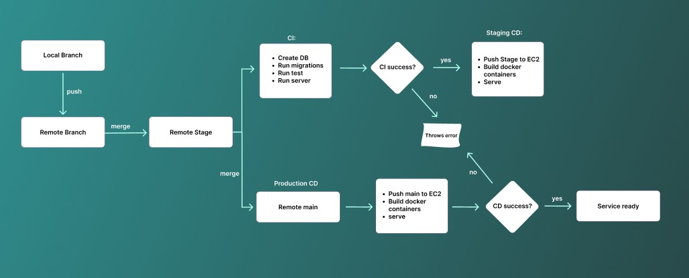

### API Testing with Swagger

- Screenshots of Swagger tests for the core APIs: Login, Create a client, and update a time entry.

| Swagger API 1                                  | Swagger API 2                                    | Swagger API 3                                        |
| ---------------------------------------------- | ------------------------------------------------ | ---------------------------------------------------- |
| 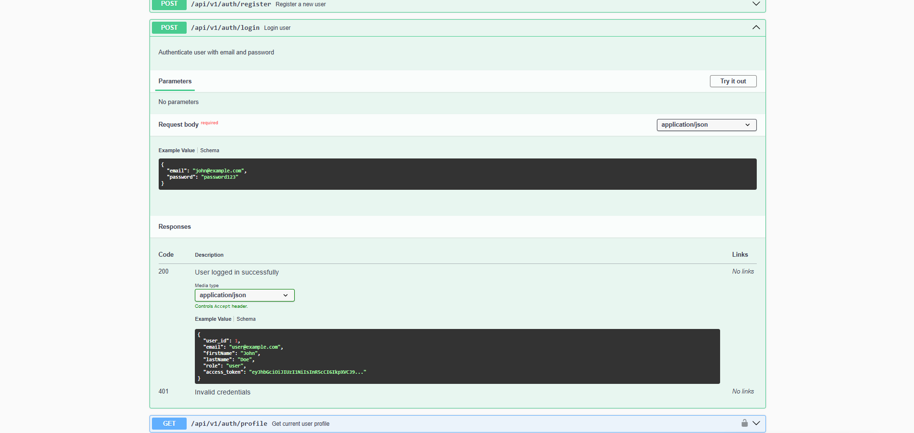 | 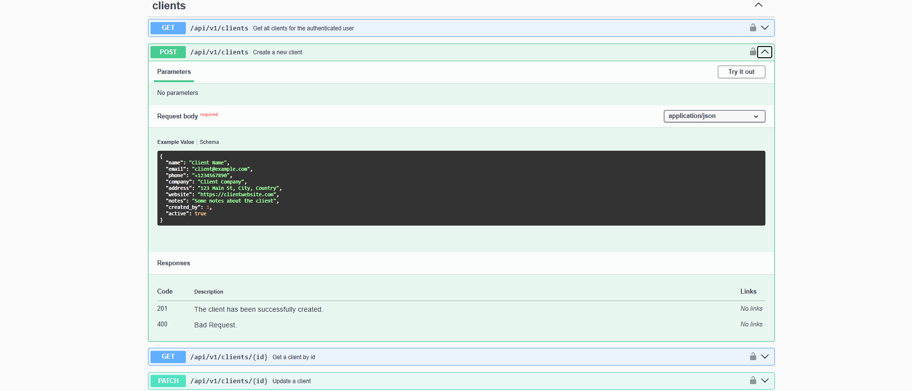 | 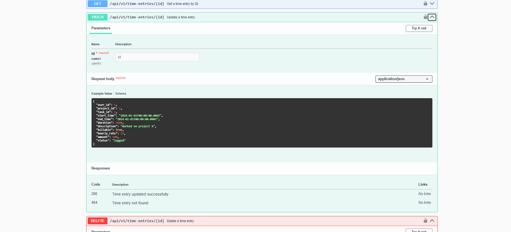 |

  
