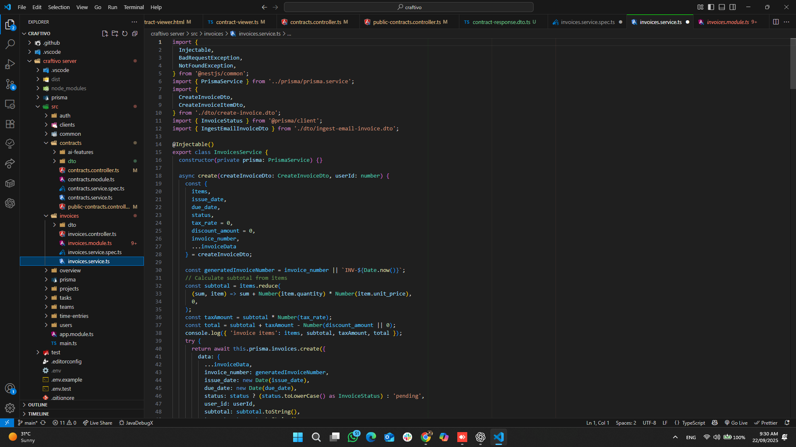
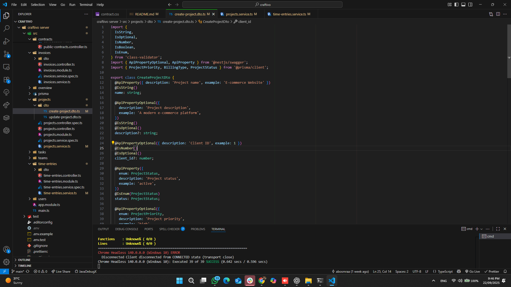
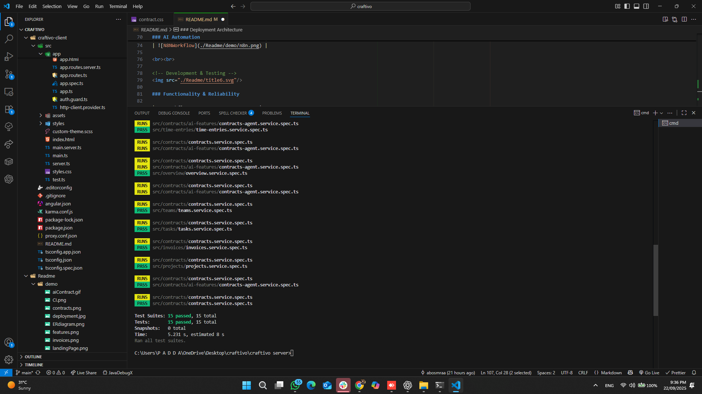
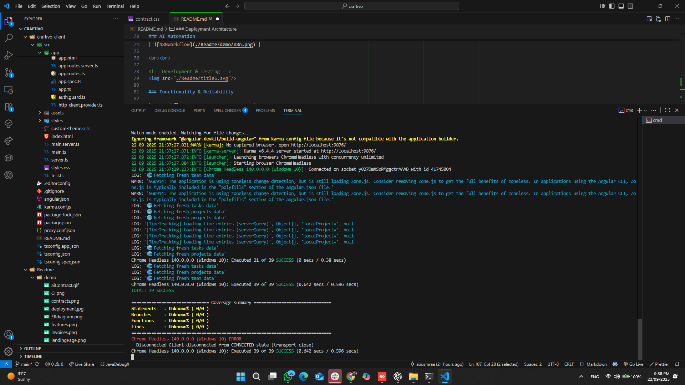

  

<!-- project overview -->

> Craftivo is a web application targeted freelancers to help them manage their projects, track time, collaborate with clients effectively and generate contracts
> the mission to add tasks for the projects and team members to each project, track invoice and time of the team they worked on and generate contract by AI.

  

<!-- System Design -->

### System Architecture

### ER Diagram

[Eraser Link](https://app.eraser.io/workspace/6fewLxrq1LB6N6Xzr0Rt)

  

<!-- Project Highlights -->

### AlignPath main features

- Intelligent Document Creation:
  The system automatically fetches user emails, identifies those containing invoices, scrapes the invoice data, and securely stores it in the database.

- Smart Invoice Scraping:
  The system automatically fetches user emails, identifies those containing invoices, scrapes the invoice data, and securely stores it in the database.

- CSV Report Generation:
  Easily export member work hours into a structured CSV file, making tracking and reporting seamless.

  
    

<!-- Demo -->

### Users Screens

| Landing Page                                  | Login Page                             |
| --------------------------------------------- | -------------------------------------- |
|  |  |

| Registration                              | Projects                                |
| ----------------------------------------- | --------------------------------------- |
|  |  |

| Teams                                | Time Tracking                                   |
| ------------------------------------ | ----------------------------------------------- |
|  |  |

| invoices                                | contracts                                 |
| --------------------------------------- | ----------------------------------------- |
|  |  |

| Ai Contracts                              |
| ----------------------------------------- |
|  |

### AI Automation

| N8N Workflow                          |
| ------------------------------------- |
|  |

  

<!-- Development & Testing -->

### Functionality & Reliability

| CI Workflow                         |
| ----------------------------------- |
|  |

### Ai agent

🌟 How Craftivo Helps You Create Contracts Effortlessly 1. You provide the project info
Example: “Build an e-commerce website for Acme Inc. starting January 15th.”

    2.	We draft your contract automatically
    •	Adds the client’s name and your name
    •	Includes project description and clear deliverables
    •	Sets out payment terms (hourly, fixed, or milestone-based)
    •	Defines start and end dates

    3.	Always personalized & complete

If details are missing (like the client’s name), Craftivo looks them up in your system so your contract always feels polished and ready.

    4.	Saved and linked to your project

The final draft is stored securely inside Craftivo, attached to the right project and client. From there, you can review, share, or sign it anytime.

  

### Services, Validation and Testing

| Services                              | Validation                             |
| ------------------------------------- | -------------------------------------- |
|  |  |

| Testing Backend                              | Testing Frontend                         |
| -------------------------------------------- | ---------------------------------------- |
|  |  |

<!-- Deployment -->

### Deployment Architecture

### API Testing with Swagger

- Screenshots of Swagger tests for the core APIs: Login, Create a client, and update a time entry.

| Swagger API 1                                  | Swagger API 2                                    | Swagger API 3                                        |
| ---------------------------------------------- | ------------------------------------------------ | ---------------------------------------------------- |
|  |  |  |

  
